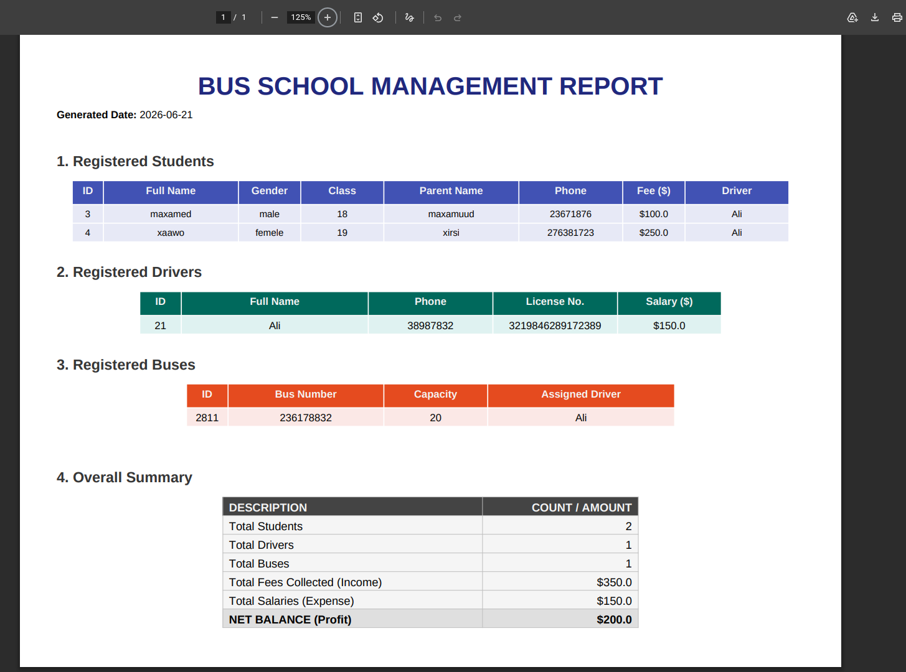

# Bus School Management System

waa barnaamij ku shaqeeya Command Line-ka (CLI) oo loo sameeyay in lagu maamulo gaadiidka iskuulada. Barnaamijkan waxa uu isku xirayaa **Ardayda**, **Darawalada**, iyo **Basaska**, isagoo u sahlaya maamulka inay si fudud xogta u kaydiyaan, wax uga bedelaan, una tirtiraan. Sidoo kale wuxu so saari report **PDF** 

---

## Astaamaha Barnaamijka (Features)

- **Maamulka Ardayda:** Ku dar (Add), Arag (View), Wax ka bedel (Edit), iyo Tirtir (Delete) xogta ardayda (Magaca, Fasalka, Lacagta baska, iwm).
- **Maamulka Darawalada:** Diiwaangeli darawalada, mushaarkooda, lambarka laysamka iyo telefoonka.
- **Maamulka Basaska:** Diiwaangeli basaska, tirada kuraasta (Capacity), iyo darawalka lagu xiray.
- **Warbixin (Reporting):** Waxa uu soo saarayaa warbixin dhameystiran ah `report.pdf` 

---

##  Muuqaalka Warbixinta (Report Preview)




---

## 📂 Qaabdhismeedka Mashruuca (Project Structure)

Barnaamijku wuxuu ka kooban yahay 4 fayl oo muhiim ah:

1. **`app.py`**: Waa faylka ugu weyn ee laga kiciyo barnaamijka (Main Application). Wuxuu hayaa Menu-ga iyo isku xirka barnaamijka.
2. **`models.py`**: Wuxuu hayaa naqshadda xogta (Dataclasses) ee `Student`, `Driver`, iyo `Bus`.
3. **`functions.py`**: Wuxuu hayaa `BusSchoolManager` class oo masuul ka ah shaqooyinka CRUD (Create, Read, Update, Delete) ee xogta.
4. **`report.py`**: Wuxuu masuul ka yahay soo saarista warbixinta (TXT & PDF) isagoo isticmaalaya library-ga ReportLab.

---

## 🛠️ Sida Loo Isticmaalo (Installation & Setup)

### 1. Shuruudaha (Prerequisites)

Waa inaad kombuyuutarkaaga ku haysataa **Python 3.x**.
 ##  ama venv isticmaal python3 -m venv venv  oo kici source venv/bin/activate

Sidoo kale, waxaad u baahan tahay library-ga `reportlab` si PDF-ka uu u shaqeeyo. Ku shub (install) adigoo isticmaalaya command-gan:

```bash
pip install reportlab
```
